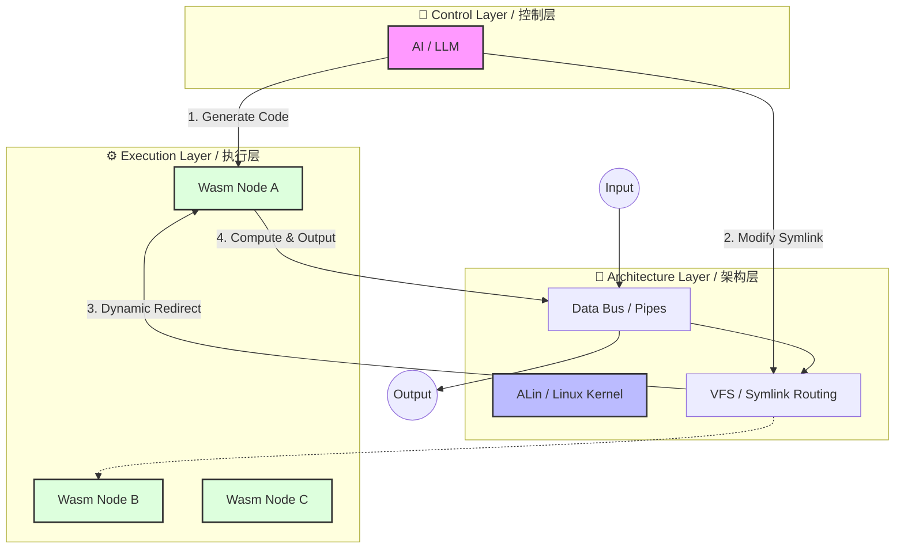
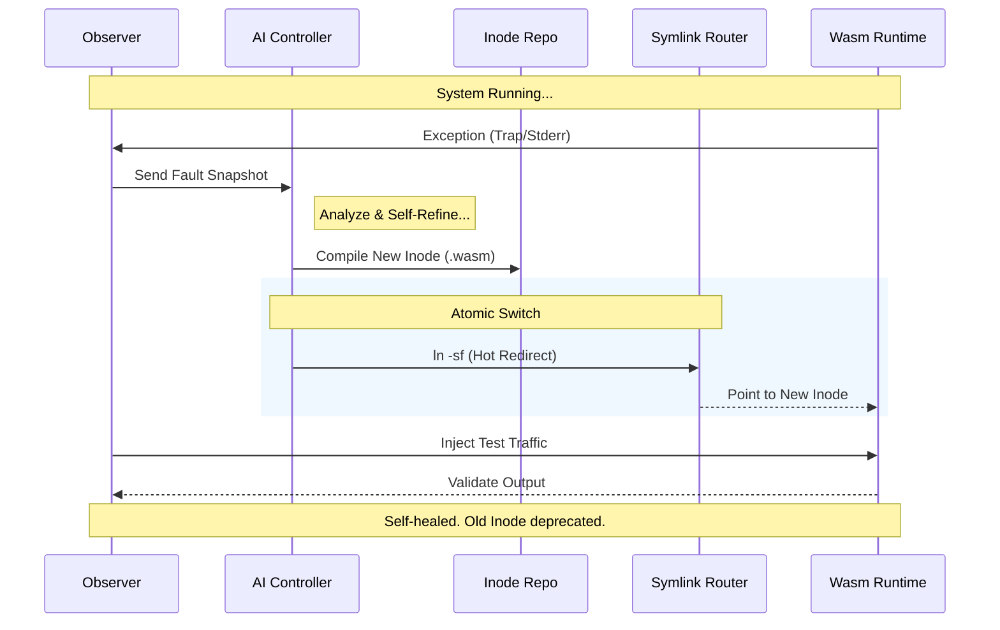
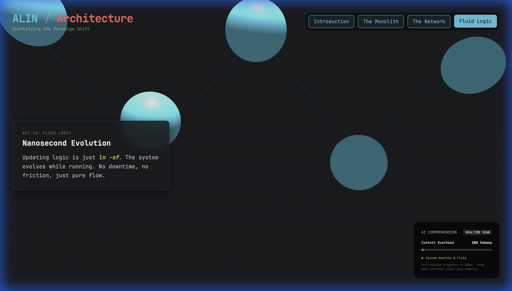
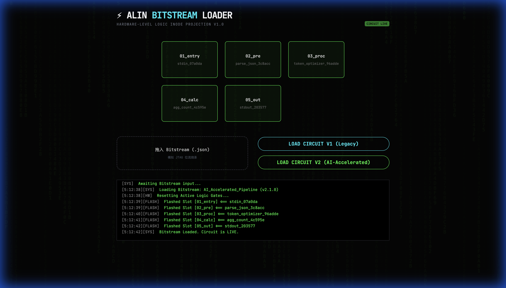
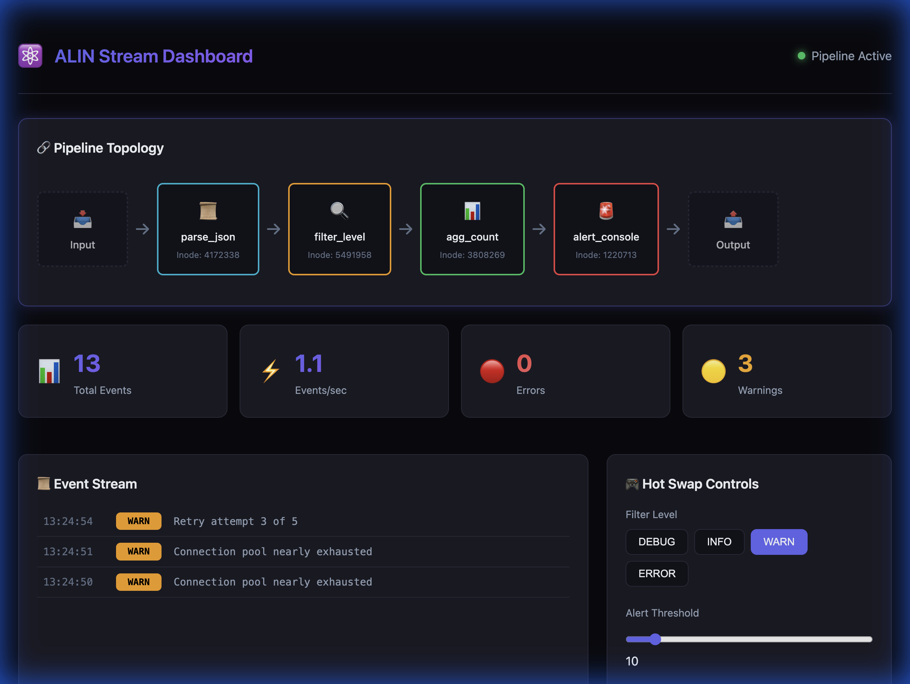
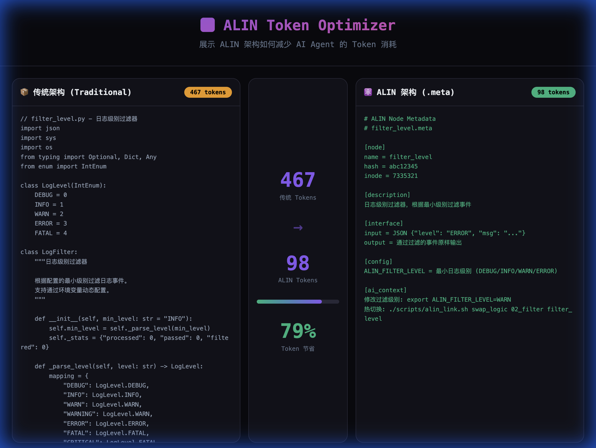
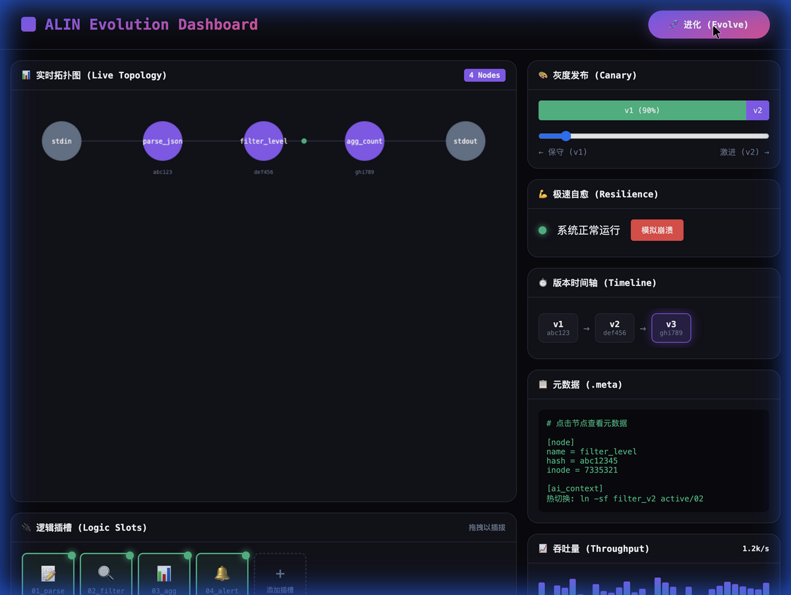

<div align="center">

# ⚛️ ALIN
### Atomic Logic Inode Network
**A Decoupled Computing Paradigm Based on OS Atomic Characteristics**
*基于操作系统原子特性的解耦合计算范式*

[](https://opensource.org/licenses/MIT)
[]()
[]()

[🎮 Online Demo / 在线演示](https://chaizhihan.github.io/Orange/) | [📖 Documentation / 文档](#architecture-specification-架构说明书) | [🚀 Quick Start / 快速开始](#quick-start-快速开始)

---

**[English](#architecture-specification-架构说明书)** | **[简体中文](#架构说明书-architecture-specification)**

</div>

---

## 📖 Architecture Specification / 架构说明书

ALIN architecture decomposes complex real-time computing tasks into three abstract layers, achieving decoupling of logic and execution through atomic path routing.
ALIN 架构将复杂的实时计算任务拆解为三个抽象层，通过原子化路径路由实现逻辑与执行的解耦合。

### 1. Core Concepts / 核心定义

*   **Logic Nodes / 逻辑节点**: Immutable computing units (scripts, binaries, or container images) stored on physical media.
    存储在物理介质上的不可变计算单元（脚本、二进制、或容器镜像）。
*   **Atomic Router / 原子路由**: Logical pointers implemented using OS filesystem symbolic links (symlinks) or hard links.
    利用操作系统文件系统的符号链接 (Symlink) 或硬链接实现的“逻辑指针”。
*   **State Bus / 状态总线**: Persistent memory spaces or data streams that survive across logic switching cycles.
    跨越逻辑切换周期、持续存在的内存空间或数据流通道。

### 2. System Architecture / 系统架构图



### 3. Self-Healing Flow / AI 自愈流程



---

## 🎬 Advanced Visualization / 高级演示

### ⚛️ ALIN 3D Narrative - The Paradigm Shift (v2)
**[Launch 3D Experience (3Blue1Brown Style)](https://chaizhihan.github.io/Orange/3d_comparison_v2.html)**

[](https://chaizhihan.github.io/Orange/3d_comparison_v2.html)

*A cinematic comparison between Traditional Monolith and ALIN Atomic Logic, quantifying AI comprehension efficiency.*
*传统巨石架构与 ALIN 原子逻辑的电影级对比，量化 AI 理解效率。*

### ⚡ ALIN Bitstream Loader - The JTAG Console
**[Burn Software Logic like FPGA Bitstreams](https://chaizhihan.github.io/Orange/bitstream_dashboard.html)**

[](https://chaizhihan.github.io/Orange/bitstream_dashboard.html)

*Deploying logic is no longer "installing software"—it's "loading bitstreams" into atomic slots.*
*部署逻辑不再是“安装软件”，而是向原子插槽中“加载位流”。*

---

## 🎮 More Examples / 示例展示

<table>
<tr>
<td>Streaming / 流处理</td>
<td>Imaging / 图像处理</td>
<td>Token Optimizer / 优化器</td>
<td>Evolution / 逻辑进化</td>
</tr>
<tr>
<td><a href="https://chaizhihan.github.io/Orange/stream_dashboard.html"></a></td>
<td><a href="https://chaizhihan.github.io/Orange/image_dashboard.html"></a></td>
<td><a href="https://chaizhihan.github.io/Orange/token_dashboard.html"></a></td>
<td><a href="https://chaizhihan.github.io/Orange/evolution_dashboard.html"></a></td>
</tr>
</table>

---

## ✨ Philosophy / 核心理念

ALIN treats **filesystem Inodes** as the fundamental unit of computation, achieving **atomic hot-swapping** of logic via **Symbolic Links (Symlink)**.
ALIN 将**文件系统的 Inode**作为计算的基本单元，通过**符号链接(Symlink)**实现逻辑的**原子级热切换**。

```
Traditional:  Restart Service → Break Connection → Cold Start → Restore State
ALIN:         ln -sf new_logic active/ → Done! (< 1ms, Zero Interruption)

传统架构:  重启服务 → 中断连接 → 冷启动 → 恢复状态
ALIN架构:  ln -sf new_logic active/ → 完成! (< 1ms, 零中断)
```

---

## 🚀 Quick Start / 快速开始

### Installation / 安装

```bash
git clone https://github.com/chaizhihan/Orange.git
cd Orange
```

### Running Demos / 运行演示

```bash
# Stream processing demo (Log analysis) / 流处理引擎演示
./scripts/demo_stream.sh

# Image processing pipeline demo / 图像处理管道演示
./scripts/demo_image.sh
```

---

## 🤖 AI Understanding Layer / AI 理解层

ALIN is **AI-Native**. We provide structured metadata and simplified protocols to reduce AI context overhead by **95%+**.
ALIN 是 **AI 原生**的。我们提供结构化元数据和简化协议，将 AI 上下文开销降低 **95%** 以上。

- [AI Quick Guide / AI 快速指南](AI_README.md)
- [Agent Protocol / Agent 协议](AGENTS.md)

---

## 🤝 Contributing / 贡献

Contributions are welcome! / 欢迎贡献! Please check [CONTRIBUTING.md](CONTRIBUTING.md) for details.

---

## 📄 License / 许可证

MIT License - See [LICENSE](LICENSE) for details.

---

<div align="center">

**ALIN** - *Where Logic Flows Through Links*

Made with ⚛️ by ChaiZhiHan

</div>
